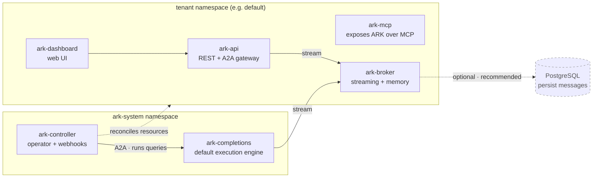

# Core concepts

This section explains **what ARK is**, how it is designed, and why key decisions were made. 

## What is ARK?

Ark is a set of open-source tools that allow teams to leverage their existing Kubernetes infrastructure to run AI agents and multi-agent systems. Key features include:

- [Platform-agnostic agent operations](../reference/query-execution).
- [Standardized deployment patterns](../operations-guide/deploying-ark).
- [Transparent orchestration](../developer-guide/observability).
- [Extensible tool integration](../reference/resources/tools).
- [Multi-agent coordination](../user-guide/teams).
- [Custom headers support](../user-guide/overrides) (e.g., request tracing, custom metadata).

## ARK architecture

The reason ARK uses Kubernetes as its foundation is to build upon battle-tested orchestration patterns for distributed systems. Review the following guides to learn more:

- [How ARK resources relate to and interact with each other](/reference/relationships).
- [How query execution flows through the system](/reference/query-execution).
- [How the ARK gateway enables external access](/developer-guide/ark-gateway).
- [How services work together](/developer-guide/services).
- [How workflows coordinate agent interactions](/developer-guide/workflows).
- [How observability provides system transparency](/developer-guide/observability).

## Architecture concepts

Ark runs in two parts. The **`ark-system` namespace** holds the platform: the controller that reconciles ARK resources and the default execution engine it dispatches queries to. A **tenant namespace** (e.g. `default`) holds the API and UI services you and your agents talk to, along with the ARK resources you create.

### Core resources

ARK's core resources represent the fundamental abstractions for building agentic systems. These resources follow Kubernetes patterns, making them familiar to platform engineers while providing specialized capabilities for AI workloads:

- [**Models**](../user-guide/models/): Configure and connect to AI models.
- [**Agents**](../user-guide/agents/): Create autonomous AI agents with specific capabilities and tools.
- [**Teams**](../user-guide/teams/): Orchestrate multiple agents working together with coordination strategies.
- [**Queries**](../user-guide/queries/): Execute prompts and manage conversations with agents or teams.
- [**Tools**](../user-guide/tools/): Define custom tools and MCP tool references for agents.
- [**MCPServers**](../user-guide/tools/): Configure Model Context Protocol servers for external integrations.
- **Memory**: Persistent storage for agent conversations and state.
- **ExecutionEngine**: Register a custom runtime (e.g. a framework executor) that the controller dispatches to instead of the built-in completions engine.
- **A2AServer**: Register an external A2A agent; the controller discovers it and creates an Agent from its agent card.
- **A2ATask**: Tracks the execution of an A2A task.
- **ArkConfig**: Cluster-scoped configuration for ARK defaults.

### Services

Alongside the controller, Ark runs a default execution engine and a set of supporting services:

- **completions engine**: The default executor — a standalone A2A service the controller calls to run the LLM turn loop, tool calls, team orchestration, and streaming. Agents with no `executionEngine` set use it.
- **ark-api**: REST API for managing ARK resources (includes the A2A gateway for agent-to-agent communication).
- **ark-dashboard**: Web-based management interface.
- **ark-mcp**: Exposes ARK resources over the Model Context Protocol so MCP clients can list and query ARK agents.
- **localhost-gateway**: Local development gateway (only on local).
- **ark-broker**: Memory storage with streaming support; messages can optionally be persisted to Postgres.

### Marketplace services

Optional services are available from the [Ark Marketplace](https://github.com/mckinsey/agents-at-scale-marketplace):

- **langfuse**: Observability and tracing service.
- **executor-langchain**: LangChain agent execution engine.

### Design effective agentic systems

The design of effective agentic systems requires understanding both technical patterns and practical constraints:

- [Tips for building agentic use cases](/user-guide/tips-on-building-agentic-use-cases).
- [Design principles](/developer-guide/design-principles).

### Extensibility concepts

Ark's extensibility model allows customization while maintaining system stability. Extension points include:

- [CRD design guidelines](/developer-guide/crd-design-guide).
- [LangChain execution engine](https://github.com/mckinsey/agents-at-scale-marketplace/tree/main/services/executor-langchain).

### Security and identity concepts

Security in ARK is built on Kubernetes RBAC and service account patterns, providing isolation and access control:

- [Authentication](/developer-guide/authentication).
