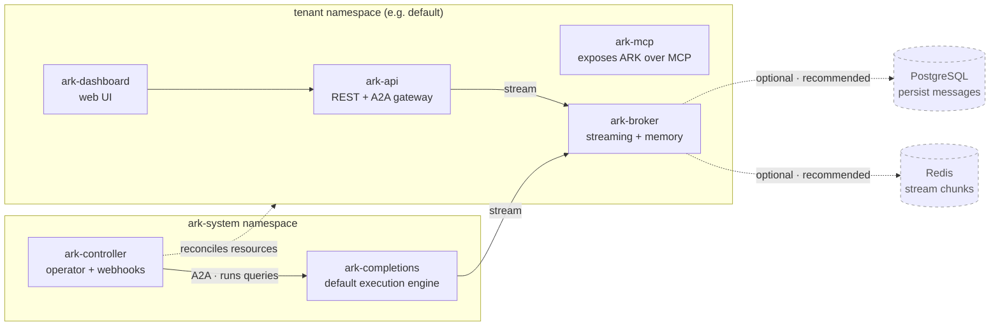

# Core concepts

This page explains the ideas behind Ark: the resources you work with, how they fit together, and how a request becomes an answer. For step-by-step instructions see the [how-to guides](/how-to-guides); for field-level detail see the [resource reference](/reference/resources/agent).

## What is Ark?

Ark runs AI agents and multi-agent systems on Kubernetes. Every part of an agentic system — the model connection, the agent, the team, the request — is a **Kubernetes custom resource** that you declare in YAML (or through the CLI, API, or dashboard). An Ark **controller** watches those resources and drives execution, so you operate agents with the same tools you already use for Kubernetes: `kubectl`, GitOps, RBAC, and namespaces for multi-tenancy.

If you've used Kubernetes the model is familiar — you describe the desired state, and a controller reconciles it.

## The core resources

Ark's resources are small, composable building blocks. Most agentic systems use only a handful:

| Resource | What it is |
| --- | --- |
| [**Model**](/reference/resources/models) | A connection to an LLM provider (OpenAI, Azure, Anthropic, Bedrock) — the reasoning engine an agent uses. |
| [**Agent**](/reference/resources/agent) | A model plus a system prompt and an optional set of tools — the basic unit that answers a request. |
| [**Tool**](/reference/resources/tools) | A capability an agent can call: an HTTP endpoint, an MCP tool, a built-in (`terminate`, `noop`), or another agent or team. |
| [**MCPServer**](/reference/resources/mcpserver) | A connection to an external [MCP](https://modelcontextprotocol.io) server. Ark discovers its tools and creates `Tool` resources automatically. |
| [**Team**](/reference/resources/team) | A group of agents (and/or sub-teams) with a **strategy** — sequential, selector, or graph — that decides who runs and when. |
| [**Query**](/reference/resources/query) | A request. It points at a target (an agent, team, model, or tool) with some input; Ark runs it and writes the answer to the query's status. |
| [**Memory**](/reference/resources/memory) | Conversation persistence, so a sequence of queries forms one continuous session. |
| [**ExecutionEngine**](/developer-guide/building-execution-engines) | A pluggable runtime. The built-in completions engine runs agents by default; register one to run a different framework (e.g. LangChain). |
| [**A2AServer**](/reference/resources/a2aserver) | A connection to an external agent that speaks the [A2A protocol](https://a2a-protocol.org). Ark discovers it and creates an `Agent` from its agent card. |

These compose: a **Model** powers an **Agent**; **Tools** and **MCPServers** give that agent capabilities; **Agents** group into a **Team**; a **Query** runs an agent, team, model, or tool; and **Memory** threads queries into a conversation. See [Resource Relationships](/reference/relationships) for the full map.

## How a query runs

Ark is declarative end to end. A request moves through four stages:

1. **Declare** — you create a `Query` (and the agent or team it targets) with `kubectl`, the `ark` CLI, the API, or the dashboard.
2. **Reconcile** — the Ark controller notices the new `Query` and resolves its target and dependencies (model, tools, memory).
3. **Execute** — the controller dispatches execution over the A2A protocol to an execution engine. The default **completions engine** runs the LLM turn loop, calls tools, coordinates team members, and streams partial output to the broker.
4. **Respond** — the result is written back to `query.status.response`, and the exchange is saved to memory.

For the detailed walkthrough, see [Query Execution Flow](/reference/query-execution).

## Architecture

Ark runs in two parts. The **`ark-system` namespace** holds the platform — the controller that reconciles resources and the default execution engine it dispatches queries to. A **tenant namespace** (e.g. `default`) holds the services you and your agents interact with — the REST/A2A API, the dashboard, the MCP interface, and the broker — alongside the resources you create.

Because every resource is namespaced, a namespace acts as a tenant: teams share one cluster while staying isolated by Kubernetes RBAC. See [Tenant and Namespace Management](/operations-guide/tenant-namespace-management).

## Why Kubernetes?

Building on Kubernetes means Ark inherits proven infrastructure instead of reinventing it:

- **Declarative and version-controlled** — resources are YAML you can manage with GitOps.
- **Secure by default** — RBAC, service accounts, and namespaces scope access and isolate tenants.
- **Composable** — models, agents, tools, and teams are independent resources you mix and match.
- **Observable** — every step emits Kubernetes events and OpenTelemetry traces.

## Learn more

- **Build something** — the [how-to guides](/how-to-guides) cover models, agents, teams, queries, and tools.
- **Resource reference** — field-level detail for every resource under [Reference → Resources](/reference/resources/agent).
- **Architecture deep-dives** — [Core Architecture](/reference/core-architecture), [Query Execution Flow](/reference/query-execution), and [Resource Relationships](/reference/relationships).
- **Extend Ark** — [execution engines](/developer-guide/building-execution-engines), [A2A servers](/developer-guide/building-a2a-servers), and the [Marketplace](https://mckinsey.github.io/agents-at-scale-marketplace) (Langfuse, Phoenix, the LangChain executor, and more).
- **Design guidance** — [Tips for building agentic use cases](/user-guide/tips-on-building-agentic-use-cases) and [Design principles](/developer-guide/design-principles).
