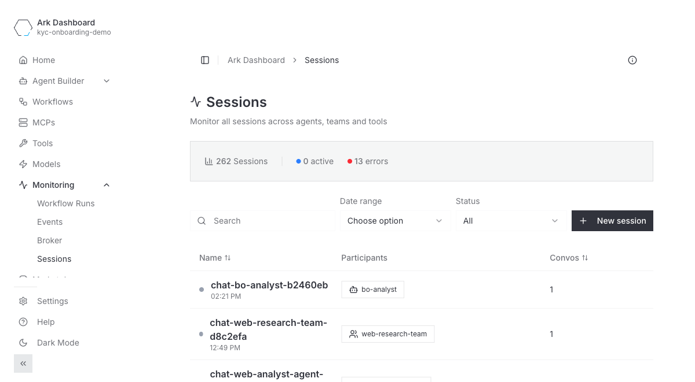
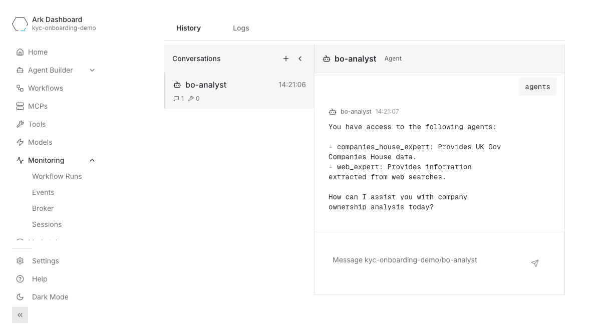
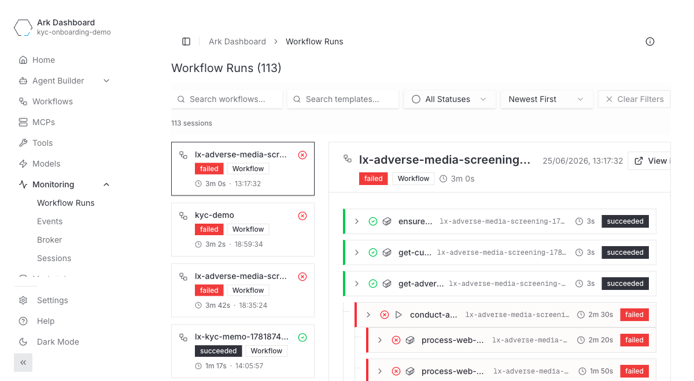
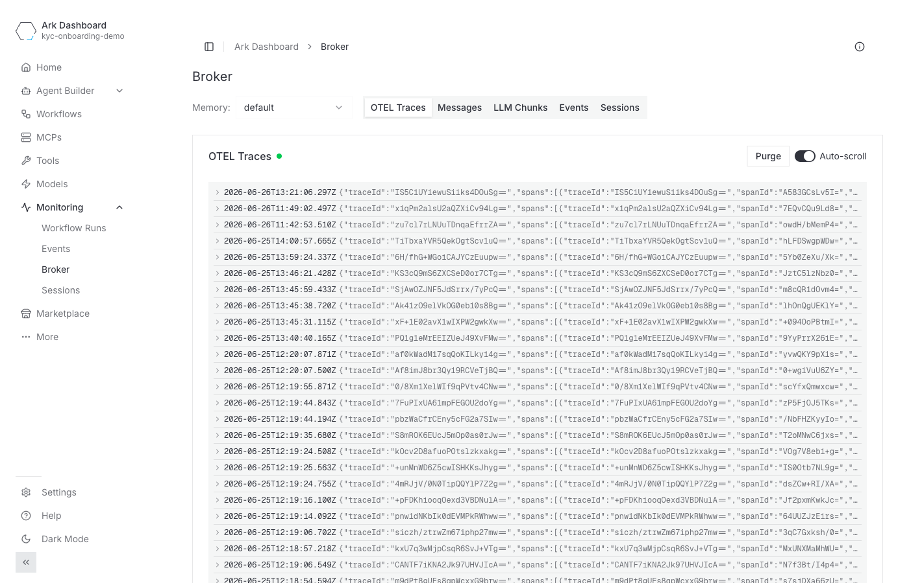

# Observability

Comprehensive observability is crucial for production agentic workloads. ARK gives you observability at two levels:

- **Built in to the dashboard** — sessions, workflow runs, Kubernetes events, and a live broker stream, with no extra setup.
- **OpenTelemetry export** — ship traces to any OTLP backend (Langfuse, Phoenix, Opik, Jaeger, Honeycomb, …) for deeper analysis, cost/token tracking, and evaluation.

## Monitoring in the dashboard

The dashboard's **Monitoring** section gives you a view of what your agents are doing without installing anything. It has four views:

| View | What it shows |
| --- | --- |
| **Sessions** | Every session across agents, teams, and tools, with active/error counts. Drill into a session to replay its conversations message by message. |
| **Workflow Runs** | Argo workflow executions with status and a per-step timing breakdown. |
| **Events** | Kubernetes events for ARK resources, filterable by type, kind, and name. |
| **Broker** | A live stream of what `ark-broker` captures — OTEL traces, messages, LLM chunks, events, and sessions. |

The **Sessions** view lists every session and its participants:



Open a session to replay the conversation:



**Workflow Runs** shows each Argo run and its steps:



The **Broker** view streams traces, messages, and LLM chunks live — useful for debugging without any external backend:



## OpenTelemetry Integration

ARK provides observability through OpenTelemetry integration, allowing you to monitor and trace all operations across the controller, execution engines and any other services. You can connect to any OpenTelemetry-compatible provider using standard environment variables.

Telemetry is enabled by setting the OpenTelemetry environment variables:

| Variable | Description | Example |
|----------|-------------|---------|
| `OTEL_EXPORTER_OTLP_ENDPOINT` | OTLP endpoint URL | `http://localhost:4318/v1/traces` |
| `OTEL_EXPORTER_OTLP_HEADERS` | Authentication headers | `Authorization=Basic <token>` |
| `OTEL_SERVICE_NAME` | Service name for telemetry | `ark-controller` |
| `OTEL_RESOURCE_ATTRIBUTES` | Additional resource attributes | `environment=production` |

## Architecture

The controller creates a root trace span (`query.<name>.dispatch`) for every query execution. Trace context propagates via W3C `traceparent` headers across A2A boundaries to the completions engine and execution engines, producing a connected trace tree.

```
┌─────────────────────┐
│   ARK Controller    │
│ query.<name>.dispatch│──── traceparent ────► Completions Engine
│  (root span)        │                       query.<name>
└─────────┬───────────┘                         └─ agent/team/model
          │                                        └─ LLM calls, tools
          │
          └──── traceparent ────► Named Execution Engine
                                  (creates own child spans)

  OTEL Env Vars
┌─────────────────────────┐
│ Services, Engines, etc  ├─── → OTEL Endpoint
└─────────────────────────┘
```

Ark's session ID propagates automatically via W3C `baggage` headers as `ark.session.id`, making it available across all services without manual header injection. The `ark.` prefix avoids collisions with executor-native `session.id` attributes.

## Per-Tenant OTEL Routing

For multi-tenant deployments, Ark supports routing traces to tenant-specific OTEL endpoints. This enables:

- **Tenant isolation** - Each tenant's traces go to their own observability backend
- **Backend flexibility** - Different tenants can use different OTEL backends (Langfuse, Phoenix, Opik, Jaeger, Honeycomb, etc.)
- **Cost attribution** - Observability costs can be attributed per tenant
- **Compliance** - Meet data residency or access control requirements

### Enabling Per-Tenant Routing

Enable per-tenant OTEL discovery in your Helm values:

```yaml
telemetry:
  tenantRouting:
    otelDiscovery: true
```

### Tenant Configuration

Each tenant configures their OTEL endpoint by creating a Secret named `otel-environment-variables` in their namespace:

```yaml
apiVersion: v1
kind: Secret
metadata:
  name: otel-environment-variables
  namespace: <tenant-namespace>
type: Opaque
stringData:
  OTEL_EXPORTER_OTLP_ENDPOINT: "https://otel-backend.example.com/v1/traces"
  OTEL_EXPORTER_OTLP_HEADERS: "Authorization=Bearer <token>"
```

The controller discovers these Secrets at startup and routes traces based on the `query.namespace` attribute.

### Example Backend Configurations

**Langfuse:**
```yaml
stringData:
  OTEL_EXPORTER_OTLP_ENDPOINT: "http://langfuse.svc:3000/api/public/otel"
  OTEL_EXPORTER_OTLP_HEADERS: "Authorization=Basic <base64(pk:sk)>"
```

**Phoenix (Arize):**
```yaml
stringData:
  OTEL_EXPORTER_OTLP_ENDPOINT: "https://app.phoenix.arize.com/v1/traces"
  OTEL_EXPORTER_OTLP_HEADERS: "api_key=<phoenix_api_key>"
```

**Opik:**
```yaml
stringData:
  OTEL_EXPORTER_OTLP_ENDPOINT: "https://www.comet.com/opik/api/v1/private/otel"
  OTEL_EXPORTER_OTLP_HEADERS: "Authorization=<opik_api_key>,Comet-Workspace=<workspace_name>,projectName=<project_name>"
```

**Honeycomb:**
```yaml
stringData:
  OTEL_EXPORTER_OTLP_ENDPOINT: "https://api.honeycomb.io/v1/traces"
  OTEL_EXPORTER_OTLP_HEADERS: "x-honeycomb-team=<api_key>"
```

**Jaeger:**
```yaml
stringData:
  OTEL_EXPORTER_OTLP_ENDPOINT: "http://jaeger-collector.svc:4318/v1/traces"
```

### Architecture with Per-Tenant Routing

When per-tenant OTEL routing is enabled, traces are routed based on the query's namespace:

```
                      ARK Controller
                            │
              ┌─────────────┼─────────────┐
              │             │             │
              ▼             ▼             ▼
        Primary OTEL   Tenant-A OTEL  Tenant-B OTEL
        (platform)     (Langfuse)     (Opik)
```

### Applying Changes

After creating or updating tenant OTEL Secrets, restart the controller to pick up new configurations:

```bash
kubectl rollout restart deployment/ark-controller -n ark-system
kubectl rollout status deployment/ark-controller -n ark-system --timeout=120s
```

## Automatic Injection of OTEL Configuration

One way to set up automatic OpenTelemetry configuration is through standardized ConfigMap and Secret references. This pattern allows any Kubernetes resource to automatically pick up OTEL environment variables when available:

```yaml
apiVersion: apps/v1
kind: Deployment
spec:
  template:
    spec:
      containers:
      - name: your-app
        envFrom:
        # Standard OTEL configuration - will be injected if available
        - configMapRef:
            name: otel-environment-variables
            optional: true
        - secretRef:
            name: otel-environment-variables
            optional: true
```

When you create or update the standardized `otel-environment-variables` ConfigMap and Secret, all deployments and pods that reference them must be restarted to pick up the new environment variables:

```bash
# Restart components to pick up changes
kubectl rollout restart deployment/ark-controller -n ark-system
```

### Service Name Configuration

You can optionally set the service name used for telemetry in your containers, using the `OTEL_SERVICE_NAME` variable:

```yaml
spec:
  template:
    spec:
      containers:
      - name: your-app
        env:
        - name: OTEL_SERVICE_NAME
          value: "my-custom-service"
```

### Additional OTEL Variables

These OpenTelemetry environment variables are also supported:

| Variable | Description | Example |
|----------|-------------|---------|
| `OTEL_RESOURCE_ATTRIBUTES` | Additional resource attributes | `environment=production,version=1.0` |
| `OTEL_EXPORTER_OTLP_TIMEOUT` | Request timeout in milliseconds | `30000` |
| `OTEL_PROPAGATORS` | Trace context propagation format | `tracecontext,baggage` |
| `OTEL_TRACES_SAMPLER` | Sampling strategy | `always_on`, `always_off`, `traceidratio` |
| `OTEL_TRACES_SAMPLER_ARG` | Sampler configuration | `0.1` (for 10% sampling) |

---

**Next**: Learn about observability options:
- **[Phoenix Service](/developer-guide/observability/phoenix-service)** - AI/ML model observability
- **[Langfuse Service](/developer-guide/observability/langfuse-service)** - Open Source LLM Application/Agent observability, evaluation, and prompt management
- **[Opik](https://github.com/comet-ml/opik)** - Open-source platform for LLM observability, evaluation, and prompt optimization
