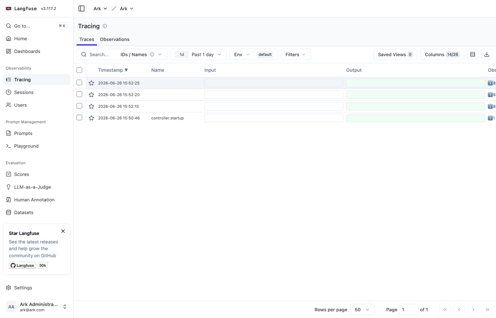
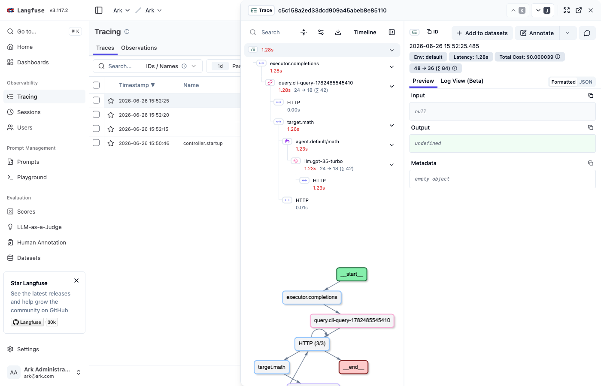

# Langfuse Service

[Langfuse](https://github.com/langfuse/langfuse) is an open-source LLM observability platform with tracing, token/cost tracking, sessions, evaluation, and prompt management. It's available from the [ARK Marketplace](https://mckinsey.github.io/agents-at-scale-marketplace/services/langfuse/), and installing it wires ARK's OpenTelemetry export to Langfuse automatically.

> **One backend per namespace**: Langfuse and Phoenix both manage the `otel-environment-variables` Secret that points ARK at a backend, so install **one of them per namespace**. If Phoenix is already installed, uninstall it (`helm uninstall phoenix -n phoenix`) before installing Langfuse, or use [per-tenant OTEL routing](/developer-guide/observability#per-tenant-otel-routing). The marketplace repo is the source of truth for install — these steps were verified against it.

## Install

Langfuse is a larger stack (Postgres, ClickHouse, Redis, and S3/MinIO), so allow a few minutes for it to come up. Install with Helm from the marketplace repo:

```bash
cd services/langfuse
helm repo add langfuse https://langfuse.github.io/langfuse-k8s
helm dependency update chart/
helm install langfuse ./chart -n telemetry --create-namespace \
  --set demo.project.publicKey=lf_pk_1234567890 \
  --set demo.project.secretKey=lf_sk_1234567890
```

`devspace deploy` works too and restarts the controller for you. Installing Langfuse creates an `otel-environment-variables` Secret in `ark-system` and `default` pointing at Langfuse:

```
OTEL_EXPORTER_OTLP_ENDPOINT = http://langfuse-web.telemetry.svc.cluster.local:3000/api/public/otel
```

With Helm, restart the components that emit spans (DevSpace does this automatically):

```bash
kubectl rollout restart deployment/ark-controller -n ark-system
kubectl rollout restart deployment/ark-completions -n ark-system
```

## View traces

Port-forward the Langfuse UI and sign in with the demo credentials (`ark@ark.com` / `password123`), then run a query:

```bash
kubectl port-forward -n telemetry svc/langfuse-web 3000:3000
# open http://localhost:3000

ark query agent/my-agent "hello"
```

Under the **Ark** project → **Tracing**, each query appears as a trace:



Open a trace to see the observation tree, latency, **token counts, and cost** (Langfuse derives these from the LLM spans), plus a flow graph:



## Reference

- [Langfuse on the ARK Marketplace](https://mckinsey.github.io/agents-at-scale-marketplace/services/langfuse/) — canonical install and configuration.
- [OpenTelemetry integration](/developer-guide/observability#opentelemetry-integration) — how ARK exports traces.

---

**Previous**: [Phoenix Service](/developer-guide/observability/phoenix-service)
