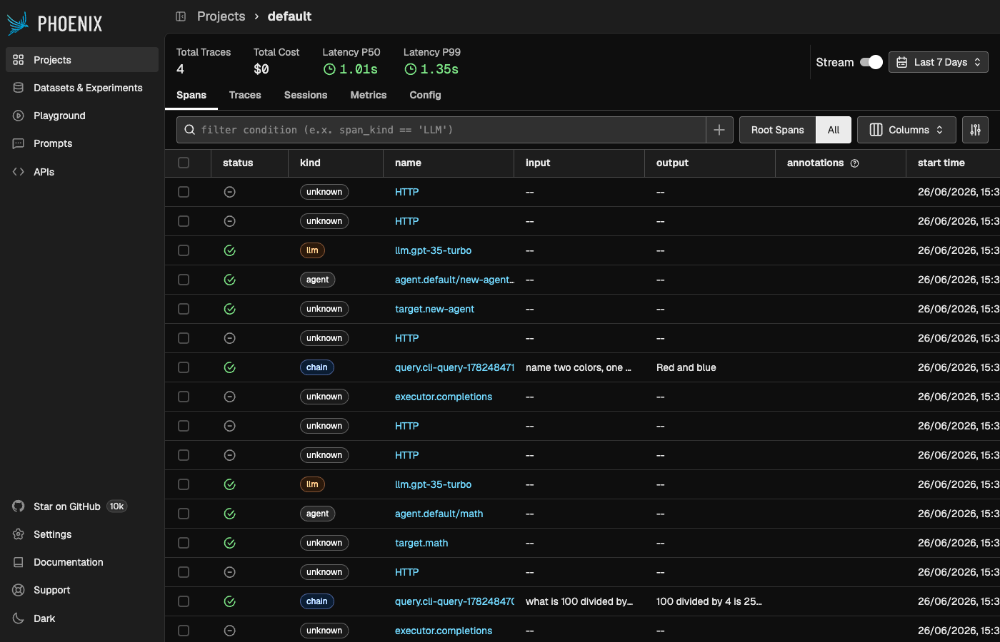
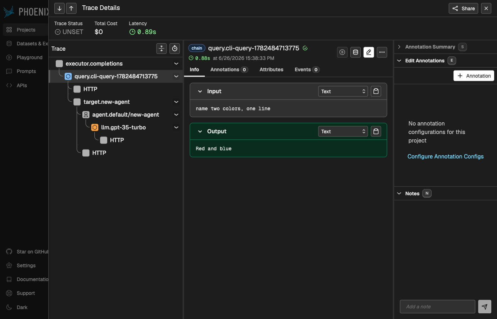

# Phoenix Service

[Phoenix](https://github.com/Arize-ai/phoenix) is an open-source AI/ML observability platform. It's available from the [ARK Marketplace](https://mckinsey.github.io/agents-at-scale-marketplace/services/phoenix/), and installing it wires ARK's OpenTelemetry export to Phoenix automatically — every query then shows up as a trace.

> **One backend per namespace**: Phoenix and Langfuse both manage the `otel-environment-variables` Secret that points ARK at a backend, so install **one of them per namespace** (Helm rejects the second install with an ownership conflict on that Secret). To run more than one backend, use [per-tenant OTEL routing](/developer-guide/observability#per-tenant-otel-routing). The marketplace repo is the source of truth for install — these steps were verified against it.

## Install

Install with Helm from the marketplace repo (clone [`agents-at-scale-marketplace`](https://github.com/mckinsey/agents-at-scale-marketplace) first):

```bash
cd services/phoenix
helm dependency update chart/
helm install phoenix ./chart -n phoenix --create-namespace
```

`devspace deploy` works too and restarts the controller for you. Installing Phoenix creates an `otel-environment-variables` Secret in the `ark-system` and `default` namespaces pointing at Phoenix:

```
OTEL_EXPORTER_OTLP_ENDPOINT = http://phoenix-svc.phoenix.svc.cluster.local:6006
OTEL_EXPORTER_OTLP_PROTOCOL = http/protobuf
```

With Helm, restart the components that emit spans so they pick up the new Secret (DevSpace does this automatically):

```bash
kubectl rollout restart deployment/ark-controller -n ark-system
kubectl rollout restart deployment/ark-completions -n ark-system
```

## View traces

Port-forward the Phoenix UI and run a query:

```bash
kubectl port-forward -n phoenix svc/phoenix-svc 6006:6006
# open http://localhost:6006

ark query agent/my-agent "hello"
```

The query appears under the `default` project. ARK's spans form a tree — `executor.completions` → `query.<name>` → `target` → `agent` → `llm.<model>` — each with its input and output:



Open a trace to see the full waterfall with inputs and outputs:



## Reference

- [Phoenix on the ARK Marketplace](https://mckinsey.github.io/agents-at-scale-marketplace/services/phoenix/) — canonical install and configuration.
- [OpenTelemetry integration](/developer-guide/observability#opentelemetry-integration) — how ARK exports traces.

---

**Next**: [Langfuse Service](/developer-guide/observability/langfuse-service)
