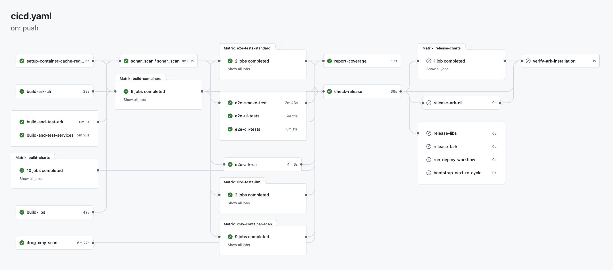

# Build Pipelines

## Pipelines

### CI/CD

The CI/CD pipeline builds and tests all ARK components, services, and documentation on every push. It includes library builds, single-platform container builds (AMD64) for testing, E2E testing, SonarQube code quality scanning, and release preparation.

The pipeline begins with a `setup-container-cache-registry` job that determines the container registry used to cache images across CI/CD pipeline stages - fork PRs use their own GitHub Container Registry namespace (e.g., `ghcr.io/username/agents-at-scale-ark`) while internal PRs use the organization's registry.



### Deploy

The Deploy pipeline is run on demand to deploy:

- Documentation to GitHub Pages
- Multi-arch Containers to the configured container registry
- Helm chart to the configured container registry (under `/charts` path)
- ARK CLI to NPM registry
- ARK Python SDK to PyPI registry
- Ark to the configured distribution environment
- Ark to the configured AWS test environment
- Ark to the configured GKE test environment

The artifacts that are deployed can be selected when the pipeline is run, as well as the specific version tag to use.

## Release Management

Ark uses [Release Please](https://github.com/googleapis/release-please) for automated release management based on conventional commits. The entire release process is automated and follows semantic versioning.

For the complete release process including RC and stable release cycles, artifact publishing, and asset management, see [Release Process and Artifacts](/reference/release-process).

### Release Flow

1. **Continuous Commit Analysis** (On every push to main)
   - Release Please runs after all CI checks pass (the `release-please` step inside the `check-release` job in `.github/workflows/cicd.yaml`)
   - Analyzes all commits since the last release using conventional commit format
   - Determines version bump based on commit types and current version:
     - For versions < 1.0.0 (current: 0.1.66): {/* x-release-please-version */}
       - `feat:` → Patch version bump (e.g. `0.1.x` → `0.1.(x+1)`) due to `bump-patch-for-minor-pre-major: true`
       - `fix:` → Patch version bump
       - `feat!:` or `BREAKING CHANGE:` → Minor version bump (e.g. `0.1.x` → `0.2.0`)
     - For versions ≥ 1.0.0:
       - `feat:` → Minor version bump (e.g. `1.0.0` → `1.1.0`)
       - `fix:` → Patch version bump (e.g. `1.0.0` → `1.0.1`)
       - `feat!:` or `BREAKING CHANGE:` → Major version bump (e.g. `1.0.0` → `2.0.0`)
     - Other types (`docs:`, `chore:`, `refactor:`, etc.) → No version bump but included in changelog

2. **Automatic Release PR Management**
   - If unreleased changes exist, Release Please creates or updates a PR titled "chore(main): release X.X.X"
   - The PR contains:
     - Updated `.github/CHANGELOG.md` with aggregated changes since last release
     - Version updates in version files across the monorepo (defined in `.github/release-please-config.json`)
     - Consistent version synchronization across all packages, charts, and services

3. **Release Activation** (When Release PR is merged)
   - The CI/CD pipeline re-runs fully and creates a GitHub release with the new version tag
   - Changelog is automatically attached to the GitHub release
   - Sets `release_created` output to trigger downstream jobs (in `.github/workflows/cicd.yaml`):
      - **release-libs**: Attaches the Python wheel files to the GitHub release
      - **release-charts**: Attaches the Helm chart packages to the GitHub release
      - **release-ark-cli**: Attaches the ARK CLI npm package to the GitHub release
      - **release-fark**: Builds the `fark` CLI with GoReleaser and attaches its binaries to the GitHub release
      - **run-deploy-workflow**: Triggers the Deploy workflow (`deploy.yml`), which publishes the distribution channels — documentation to GitHub Pages, multi-arch containers, the Helm chart, the npm CLI, and the PyPI SDK
   - On stable releases only, **verify-ark-installation** smoke-tests the published install and **bootstrap-next-rc-cycle** opens the next release-candidate cycle

### Version Synchronization

Release Please updates versions in the following locations:
- Root `version.txt`
- Python packages (`pyproject.toml` files)
- Helm charts (`Chart.yaml` files)
- Node.js packages (`package.json` files)
- Kubernetes manifests (`manager.yaml`)
- All service and library versions

### Validate PR Title

Ensures pull request titles follow conventional commit format described in the repository `CONTRIBUTING.md` for consistent squash merge messages.

### SonarQube Code Analysis (SCAS)

Automated code quality and security analysis. The SonarQube scan job uses a self-hosted runner as it needs access to the internal SonarQube environment. If you fork this repository, you will need to adapt this to your own SonarQube configuration. Expected to fail in open source repositories as it requires McKinsey-specific infrastructure.

## Recommended GitHub Configuration

Configure repository settings to enforce conventional commits for automated release management:

- General → Pull Requests: Enable only squash merging
- Branches → Branch Protection: Require `validate-title` status check and linear history

## Configuration

GitHub variables and secrets for ARK build and deployment workflows. All configuration is **optional** - if not provided, workflows will default to using GitHub Container Registry (GHCR).

| Name | Type | Purpose | Default Value |
|------|------|---------|---------------|
| **Docker Registry (Production)** | | | |
| `DOCKER_REGISTRY` | Variable (Optional) | Main registry URL for version-tagged production/release images | `ghcr.io/{repository_owner}/{repository_name}` |
| `DOCKER_REGISTRY_USERNAME` | Secret (Optional) | Username for main registry authentication | `${{ github.actor }}` |
| `DOCKER_REGISTRY_PASSWORD` | Secret (Optional) | Password/token for main registry authentication | `${{ secrets.GITHUB_TOKEN }}` |
| **CI Cache Registry (Build Artifacts)** | | | |
| `DOCKER_CICD_CACHE_REGISTRY` | Variable (Optional) | Registry URL for SHA-tagged intermediate images and CI/CD build cache | `ghcr.io/{repository_owner}/{repository_name}` |
| `DOCKER_CICD_CACHE_REGISTRY_USERNAME` | Secret (Optional) | Username for CI cache registry authentication | `${{ github.actor }}` |
| `DOCKER_CICD_CACHE_REGISTRY_PASSWORD` | Secret (Optional) | Password/token for CI cache registry authentication | `${{ secrets.GITHUB_TOKEN }}` |
| **Azure OpenAI (Testing)** | | |
| `CICD_AZURE_OPENAI_KEY` | Secret | Azure OpenAI API key for E2E quickstart tests | |
| `CICD_AZURE_OPENAI_BASE_URL` | Secret | Azure OpenAI base URL for E2E quickstart tests | |
| **Distribution Environment Deployment** | | |
| `DEPLOY_CLUSTER_LOGIN_URL` | Secret | Kubernetes cluster login URL for centralized deployment environment | |
| `DEPLOY_CLUSTER_IDP_ISSUER_URL` | Secret | Identity provider issuer URL for cluster authentication | |
| **Documentation Site** | | |
| `DOCS_SITE_BASE_PATH` | Variable (Optional) | Base path for documentation site when serving from non-root URL (e.g., GitHub Pages) | |
| **NPM Registry (CLI Deployment)** | | |
| `NPM_TOKEN` | Secret (Optional) | NPM authentication token with publish permissions for CLI deployment. Not required when using [Trusted Publishing](#trusted-publishing-for-npm). | |
| **PyPI Registry (Python SDK Deployment)** | | |
| `TEST_PYPI_API_TOKEN` | Secret (Required for PyPI deployment) | TestPyPI authentication token for testing Python package deployment | |
| `PYPI_API_TOKEN` | Secret (Required for PyPI deployment) | PyPI authentication token with publish permissions for Python SDK deployment | |
| **Code Quality and Analysis** | | |
| `SONARQUBE_TOKEN` | Secret | SonarQube authentication token |
| `SONARQUBE_PROJECT_KEY` | Secret | SonarQube project identifier |
| `SONARQUBE_HOST_URL` | Variable | SonarQube server URL | `https://sonarqube-dev.mckinsey.com/` |
| `ARTIFACTORY_USER` | Secret | Artifactory username for dependency resolution |
| `ARTIFACTORY_PASS` | Secret | Artifactory password for dependency resolution |
| `CODECOV_TOKEN` | Secret (Required for CI) | Codecov authentication token for test coverage reporting. CI builds will fail if not set. |

## Trusted Publishing for npm

Trusted publishing uses OpenID Connect (OIDC) to authenticate npm publishes directly from GitHub Actions, eliminating the need for long-lived `NPM_TOKEN` secrets. This is the recommended approach for npm package deployment.

### Setup

1. Navigate to your package settings on [npmjs.com](https://www.npmjs.com)
2. Find the "Trusted Publisher" section
3. Select "GitHub Actions" as your provider
4. Configure the following fields:
   - **Organization or user**: Your GitHub username or organization name
   - **Repository**: Your repository name (e.g., `agents-at-scale-ark`)
   - **Workflow filename**: `deploy.yml`
   - **Environment name**: Leave empty unless using GitHub environments

### Workflow Configuration

The deploy workflow includes the required OIDC permissions and npm version:

```yaml
permissions:
  id-token: write  # Required for OIDC trusted publishing
  contents: read

steps:
  - name: Install npm with trusted publishing support
    run: npm install -g npm@11  # Requires npm 11.5.1+

  - name: Publish to npm
    run: npm publish --provenance  # Provenance adds supply chain attestations
```

Once configured on npmjs.com, npm will automatically use OIDC authentication and fall back to `NPM_TOKEN` if trusted publishing is not configured.

### Security Recommendation

After enabling trusted publishers, restrict traditional token-based access:

1. Navigate to your package's Settings → Publishing access on npmjs.com
2. Select "Require two-factor authentication and disallow tokens"
3. Revoke any existing `NPM_TOKEN` secrets that are no longer needed

## Troubleshooting

### Uppercase Organization Names

Unless otherwise specified, GHCR is used as the default Docker container registry, with the value `ghcr.io/<org_name>`. Docker registry names must be lowercase. If your GitHub organization name contains uppercase characters, you must explicitly set the Docker registry secrets with lowercase values. For example, for the organization `My-Org`, set:

```yaml
DOCKER_REGISTRY: "ghcr.io/my-org" 
DOCKER_CICD_CACHE_REGISTRY: "ghcr.io/my-org"
```

### GitHub Pages Documentation Deployment
When deploying documentation to GitHub Pages, the site is served from a subpath (e.g., `mckinsey.github.io/agents-at-scale-ark`). To ensure assets load correctly, set the `DOCS_SITE_BASE_PATH` repository variable to match your repository name:

```yaml
DOCS_SITE_BASE_PATH: "/agents-at-scale-ark"
```

This configures the Next.js build to serve all assets from the correct subpath. Without this setting, CSS, JavaScript, and images will fail to load when deployed to GitHub Pages.
