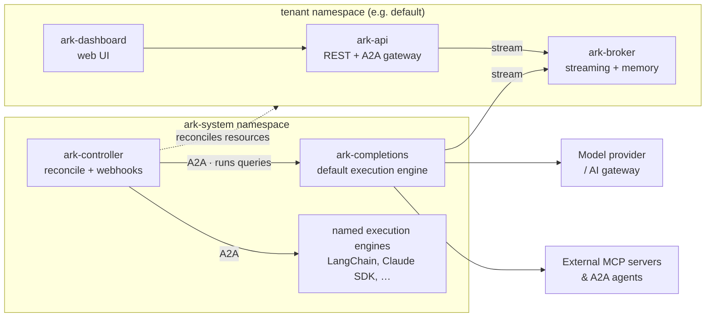

# Core Architecture

Ark is a set of Kubernetes services built around a controller that reconciles custom resources. This page covers those components, how they connect to each other and to external tools and agents, the storage backends Ark supports, and how it fits into a cloud deployment.

For how an individual request runs and is persisted, see [Query Execution Flow](/reference/query-execution). For the resources themselves, see [Resources](/reference/resources) and [Resource Relationships](/reference/relationships).

## Services and components

Ark runs in two parts. The **`ark-system` namespace** holds the control plane — the controller that reconciles resources plus the execution engines it dispatches to. A **tenant namespace** holds the services you and your agents interact with — the REST/A2A API, the dashboard, and the broker — alongside the resources you create. Execution engines call out to model providers and any external MCP servers or A2A agents, and stream partial output to the broker.



| Component | Role | Reference |
| --- | --- | --- |
| **Ark controller** | Reconciles Ark resources; runs validating/mutating webhooks; dispatches queries. Leader-elected. | — |
| **Completions engine** | Default executor — runs the LLM turn loop, tool calls, team orchestration, memory, and streaming. A standalone A2A service. | [ark-completions](/developer-guide/services/ark-completions) |
| **ark-api** | REST gateway for Ark resources and queries; also hosts the A2A gateway that exposes agents. | [ark-api](/developer-guide/services/ark-api) |
| **ark-broker** | Event bus for streaming chunks and conversation memory (in-memory by default; PostgreSQL/Redis backends optional). | [ark-broker](/developer-guide/services/ark-broker) |
| **ark-dashboard** | Web UI for managing resources and chatting with agents and teams. | [Dashboard](/developer-guide/ark-dashboard) |
| **Gateway** | Kubernetes Gateway API (NGINX Gateway Fabric) that exposes services and routes outside the cluster. | [Gateway](/developer-guide/ark-gateway) |

Named execution engines (LangChain, Claude Agent SDK, and others) plug in alongside the completions engine — an agent opts into one via `spec.executionEngine`, and the controller dispatches to it over A2A. See the [services overview](/developer-guide/services) for the full list.

## Connecting MCP servers and A2A agents

Ark extends an agent's reach through two external integration points, both modelled as resources the controller watches:

- **MCP servers** — an [`MCPServer`](/reference/resources/mcpserver) registers a Model Context Protocol endpoint. Ark discovers its tools and surfaces them as `Tool` resources that agents can call. Per-user credentials are handled with query-level header overrides (see [User-authorised MCP servers](/tutorials/user-authorised-mcp-servers)); for building your own, see [MCP server samples](/user-guide/samples/mcp-servers).
- **A2A agents** — an [`A2AServer`](/reference/resources/a2aserver) points at a remote Agent-to-Agent server. Ark discovers the agents it advertises and creates local `Agent` resources backed by the `a2a` execution engine, so a remote agent is queried exactly like a native one. To build a compatible server, see [Building A2A servers](/developer-guide/building-a2a-servers).

## Storage backends

Ark supports two storage backends for its resources; the choice is a deployment decision and is transparent to clients using `kubectl` or the Ark API.

- **etcd (default)** — Ark resources are installed as CRDs and stored in etcd alongside standard Kubernetes objects. Simplest to run; best for small-to-medium installs.
- **PostgreSQL (aggregated)** — a [Kubernetes aggregated API server](https://kubernetes.io/docs/concepts/extend-kubernetes/api-extension/apiserver-aggregation/) serves the `ark.mckinsey.com` group from a PostgreSQL database instead of etcd. Better for large resource counts, heavy `LIST` operations, and multi-replica deployments, with `pg_notify`-driven cross-replica watch delivery.


See [Query Execution Flow → How the query is stored](/reference/query-execution#how-the-query-is-stored) for how a query moves through each backend, [PostgreSQL Storage Backend](/operations-guide/postgres-storage-backend) for setup and operation, and [Scalability](/reference/scalability) for capacity and performance.

## Deploying on AWS and Azure

Ark runs on any conformant Kubernetes cluster — EKS, GKE, or AKS. Two deployment concerns are cloud-specific:

- **Managed PostgreSQL** — the aggregated backend works with any Postgres that allows logical replication: Amazon RDS, Azure Database for PostgreSQL, or Google Cloud SQL. Setup for each is covered in [PostgreSQL Storage Backend](/operations-guide/postgres-storage-backend).
- **Cloud identity for models** — models authenticate with cloud credentials rather than static keys: Azure Managed Identity or Workload Identity for Azure OpenAI, and IAM roles for AWS Bedrock. See [Models](/reference/resources/models) for the auth options per provider.

For provisioning clusters with Terraform, [Cloud Infrastructure Provisioning](/operations-guide/provisioning) covers EKS and GKE; there is no dedicated AKS walkthrough yet, but Ark installs on AKS the same way via [Deploying Ark](/operations-guide/deploying-ark).

## Connecting an AI gateway

Ark reaches models over HTTP, so it works with any OpenAI-compatible or Azure AI gateway. Point a `Model` at the gateway with `spec.config.<provider>.baseUrl` and supply credentials from a Secret (or a cloud managed identity):

```yaml
apiVersion: ark.mckinsey.com/v1alpha1
kind: Model
metadata:
  name: gateway-model
spec:
  provider: openai
  model:
    value: gpt-4o
  config:
    openai:
      baseUrl:
        value: https://my-ai-gateway.example.com/v1
      apiKey:
        valueFrom:
          secretKeyRef:
            name: gateway-credentials
            key: token
```

See [Models](/reference/resources/models) for the full provider configuration and [Model URL Security](/operations-guide/model-url-security) for hardening gateway connections.

## Related

- [Query Execution Flow](/reference/query-execution) — how a query runs and is stored.
- [Resources](/reference/resources) — the Ark CRDs.
- [Services](/developer-guide/services) — the runtime services in detail.
- [PostgreSQL Storage Backend](/operations-guide/postgres-storage-backend) and [Scalability](/reference/scalability) — running Ark at scale.
