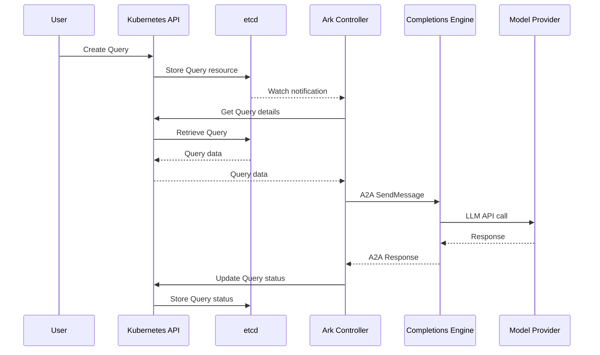
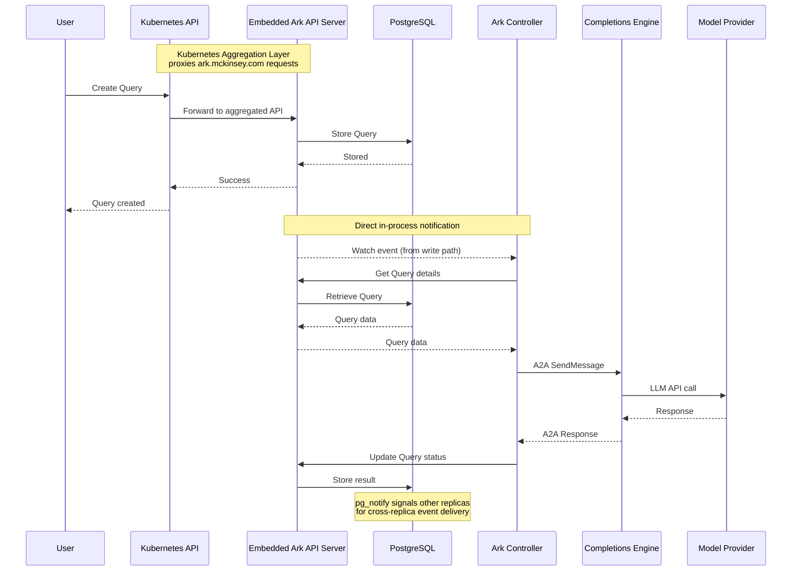
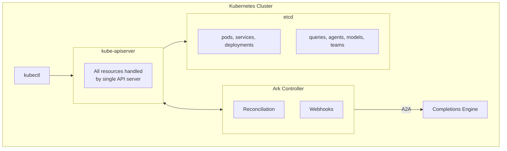
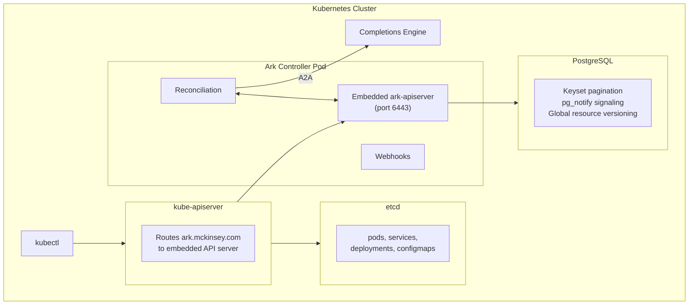

# Core Architecture

This page describes the current architecture of Ark and the planned aggregated architecture that addresses scalability concerns.

## Current Architecture

The current Ark deployment consists of:

- **Ark Core (Controller)**: Go-based component with metrics, webhook, and controller modules
- **Completions Engine**: Standalone A2A service that runs the LLM turn loop, tool execution, team orchestration, and streaming
- **Kubernetes API Server**: Handles standard Kubernetes and Ark custom resources
- **etcd**: Stores all Kubernetes resources including Ark custom resources (Agents, Models, Queries, etc.)

All Ark resources are stored in etcd alongside standard Kubernetes resources. The controller delegates query execution to the completions engine via A2A protocol over a K8s service. The engine handles agent execution, tool calls, team orchestration, memory, and streaming to ark-broker.

### Current Query Execution Flow



In the current architecture, the controller processes queries through its reconciliation loop. The Query reconciler runs up to `maxConcurrentReconciles` worker goroutines in parallel (default 4) and caps concurrent in-flight executions at `maxConcurrentQueries` (default 32). Because reconciliation runs only on the leader, query throughput does not scale horizontally with replica count — production tuning is done by adjusting these limits and the controller's resource allocation. See [Scalability](/reference/scalability) for details.

## Aggregated Architecture

The aggregated architecture uses **Kubernetes aggregation layer** to introduce a dedicated data layer for Ark resources with horizontal query processing.

### Kubernetes Aggregation Layer

The [Kubernetes aggregation layer](https://kubernetes.io/docs/concepts/extend-kubernetes/api-extension/apiserver-aggregation/) allows extending the Kubernetes API with additional API servers. The Ark apiserver registers itself as an aggregated API server, handling all `ark.mckinsey.com` API group requests while the main Kubernetes API server handles standard resources.

When a user creates an Ark resource (Query, Agent, Model, etc.), the Kubernetes API server proxies the request to the Ark apiserver, which stores data in Postgres instead of etcd.
<br/>


### Components

- **Ark Core**: Enhanced with ark-apiserver and query-workers modules
  - **metrics module**: Exposes metrics
  - **webhook module**: Validates Ark resources
  - **controller module**: Reconciles Ark resources (leader-elected)
  - **ark-apiserver module**: Registered as Kubernetes aggregated API server, handles all Ark custom resources
  - **query-workers module**: Processes query queue items (horizontally scalable)
- **Kubernetes API Server**: Handles standard Kubernetes resources, proxies `ark.mckinsey.com` API requests to ark-apiserver
- **etcd**: Stores standard Kubernetes resources only (Ark resources no longer stored here)
- **Ark Database (Postgres)**:
  - Sits behind ark-apiserver
  - Stores all Ark custom resources (Agents, Models, Queries, etc.)
  - Manages query queue with SKIP LOCKED support

### Aggregated Query Execution Flow



### Watch Event Delivery

The PostgreSQL backend uses a three-layer event delivery pipeline:

1. **Same-replica (instant)**: Write operations (`Create`, `Update`, `Delete`) notify watchers directly via goroutine after the DB operation succeeds. The object is reconstructed from `INSERT/UPDATE ... RETURNING` data — no separate query needed.

2. **Cross-replica (~1-5ms)**: A PostgreSQL trigger fires `pg_notify` on every write. Other replicas' listeners receive the signal and trigger an immediate high-water-mark catch-up query (`WHERE resource_version > lastSeen`). For `DELETE` operations, the notification payload is used to build a stub and deliver the event directly (deleted rows can't be queried).

3. **Safety net (≤30s)**: Each watcher runs a periodic catch-up sweep using the same high-water-mark query. Catches any events missed for any reason.

The watcher uses a dual-channel design for panic safety: an internal `ch` (writers send here, never closed) and a consumer-facing `outCh` (only the `run()` goroutine writes and closes). `resource_version` uses PostgreSQL's global sequence (`nextval`) for globally unique values across all rows.

### Scalability

The aggregated architecture enables:

- **Ark Core replicas**: One leader (reconciliation), multiple non-leaders (webhooks, metrics, embedded apiserver). Cross-replica watch events delivered via pg_notify signaling.
- **Efficient storage**: PostgreSQL handles Ark resource storage more efficiently than etcd for large datasets
- **Database replicas**: PostgreSQL replication for read scalability
- **Connection pool**: Configurable per replica (default 40), sized for multi-replica deployments against typical `max_connections=100`

### Benefits

- **Kubernetes-native extension**: Uses standard Kubernetes aggregation layer pattern for seamless API integration
- **Better scalability**: PostgreSQL handles Ark resource storage more efficiently than etcd for large datasets
- **Efficient LIST operations**: Keyset pagination and indexes for fast queries
- **Reliable watches**: Direct notification from write path + high-water-mark catch-up for self-healing event delivery
- **Multi-replica ready**: pg_notify signaling for cross-replica event delivery without polling
- **Enhanced observability**: Database schema supports advanced observability views
- **etcd relief**: Reduces load on etcd by storing only core Kubernetes resources

---

## Deployment Configurations

Ark supports two storage backend configurations. Choose based on your scale and operational requirements.

### Configuration 1: Standard (etcd)

The default Kubernetes-native deployment where Ark resources are stored in etcd alongside standard Kubernetes resources.



**Characteristics:**
- Single storage backend for all resources
- Controller delegates query execution to completions engine via A2A
- Simple deployment, no additional infrastructure
- Standard Kubernetes CRD pattern

**When to use:**
- Small to medium deployments (< 1,000 Ark resources)
- Low query concurrency requirements
- Minimal infrastructure preference
- Standard Kubernetes operational model

### Configuration 2: Aggregated (PostgreSQL)

Uses the Kubernetes aggregation layer to route Ark API requests to a dedicated API server backed by PostgreSQL.



**Characteristics:**
- Dedicated storage for Ark resources in PostgreSQL
- Embedded API server within controller pod
- Controller delegates query execution to completions engine via A2A
- Direct in-process watch events + pg_notify for cross-replica delivery
- High-water-mark catch-up sweep as self-healing safety net
- Keyset pagination for efficient LIST operations

**When to use:**
- Large deployments (> 1,000 Ark resources)
- High query concurrency requirements
- Heavy LIST operations at scale
- Need for advanced querying capabilities

### Performance Comparison

Benchmarks at 10,000 Ark resources:

| Operation | etcd | PostgreSQL | Winner |
|-----------|------|------------|--------|
| **LIST latency (P50)** | 2,980ms | 1,504ms | PostgreSQL (2x faster) |
| **LIST throughput** | 6.1 ops/sec | 12.5 ops/sec | PostgreSQL (2x higher) |
| **Create latency (P50)** | 107ms | 106ms | Comparable |
| **Get latency (P50)** | 103ms | 106ms | Comparable |
| **Watch latency (P50)** | - | 73ms | PostgreSQL (excellent) |

**Production capacity (PostgreSQL):**
- Burst throughput: ~230 ops/sec
- Sustained throughput: ~180 ops/sec
- Watch capacity: 200+ concurrent watchers at 80ms P50 latency
- Optimal concurrency: 50-100 workers

### Migration Path

Migrating from etcd to PostgreSQL configuration:

1. Deploy PostgreSQL database
2. Deploy ark-apiserver with aggregated API configuration
3. Register APIService for `ark.mckinsey.com` group
4. Migrate existing resources using `kubectl get -o yaml | kubectl apply -f -`
5. Verify watch events and controller reconciliation

Resources are fully compatible between configurations - the storage backend is transparent to clients using `kubectl` or the Kubernetes API.

---

## Implementation Status

The aggregated architecture is fully implemented and ready for use:

| Component | Status | Location |
|-----------|--------|----------|
| **Embedded API Server** | Complete | `ark/internal/apiserver/` |
| **PostgreSQL Storage** | Complete | `ark/internal/storage/postgresql/` |
| **OpenAPI Schema Generation** | Complete | From embedded CRDs |
| **Controller Integration** | Complete | `ark/cmd/main.go` |
| **Helm Chart Configuration** | Complete | `ark/dist/chart/` |

### Enabling PostgreSQL Backend

To deploy Ark with the PostgreSQL storage backend, configure the Helm values:

```yaml
storage:
  backend: "postgresql"  # Options: "etcd" (default), "postgresql"
  apiserver:
    port: 6443
  postgresql:
    host: "postgresql.ark-system.svc.cluster.local"
    port: 5432
    database: "ark"
    user: "ark"
    passwordSecretName: "postgresql-credentials"
    passwordSecretKey: "password"
    sslMode: "disable"  # Options: disable, require, verify-ca, verify-full
```

Install with PostgreSQL backend:

```bash
helm install ark ./ark/dist/chart -n ark-system \
  --set storage.backend=postgresql \
  --set storage.postgresql.host=postgresql \
  --set storage.postgresql.user=postgres \
  --set storage.postgresql.passwordSecretName=postgresql-credentials
```

When using PostgreSQL backend, Ark CRDs are not installed (resources are stored in PostgreSQL instead of etcd). The embedded API server registers as a Kubernetes aggregated API server.

### Multi-Replica Deployment

To run multiple Ark controller replicas with the PostgreSQL backend:

```yaml
storage:
  backend: "postgresql"
  postgresql:
    host: "postgresql.ark-system.svc.cluster.local"
    port: 5432
    database: "ark"
    user: "ark"
    passwordSecretName: "postgresql-credentials"

controllerManager:
  replicas: 2

queryEngine:
  enabled: true
  container:
    port: 9090
```

Each replica connects to the same PostgreSQL database. Event delivery across replicas uses pg_notify signaling — when replica A writes a resource, replica B receives the notification within ~1-5ms and runs a catch-up query to fetch the new data. Only one replica runs as leader (controller reconciliation), but all replicas serve API requests, webhooks, and watch streams.

**Connection pool sizing**: Each replica uses up to `MaxOpenConns` database connections (default 40). With `max_connections=100` on PostgreSQL, 2 replicas use 80 connections, leaving 20 for admin and monitoring. Adjust `MaxOpenConns` based on your replica count and PostgreSQL `max_connections`.

### Available Storage Backends

The PostgreSQL storage backend implements the storage interface (`ark/internal/storage/interface.go`) with:
- Direct notification from write path for instant same-replica event delivery
- pg_notify signaling for cross-replica event delivery
- High-water-mark catch-up sweep as safety net (every 30s, O(changed) not O(total))
- Globally unique resource versions via PostgreSQL sequence (`nextval`)
- Keyset pagination for efficient LIST operations
- Composite indexes for fast queries
- Configurable connection pooling (default 40 open / 20 idle per replica)
