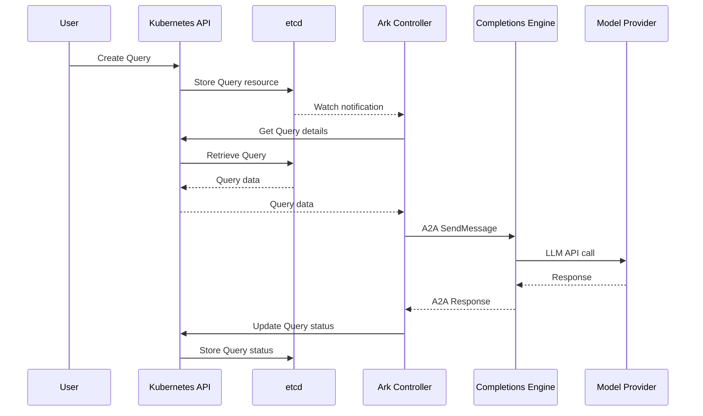
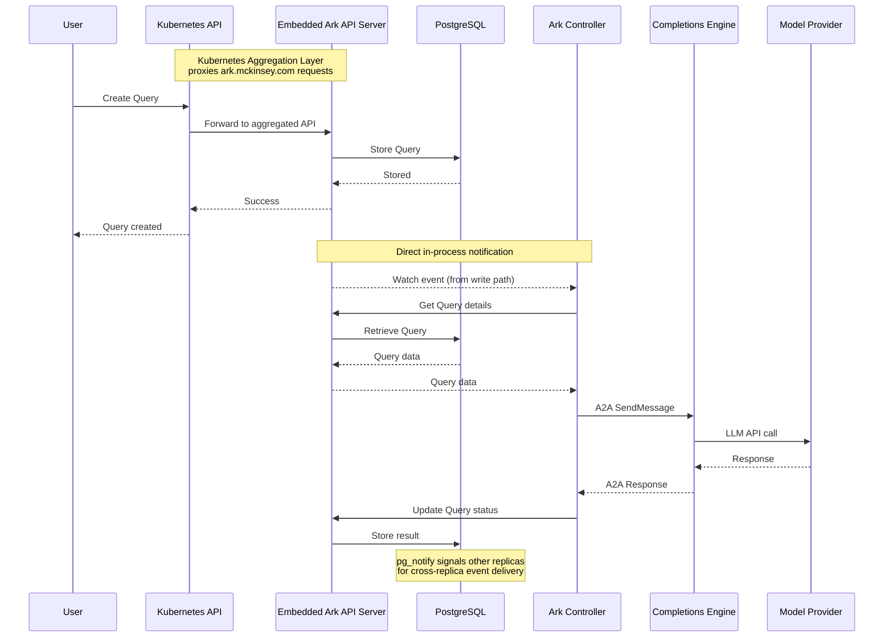

# Query Execution Flow

A `Query` is how you ask an agent, team, model, or tool to do something. This page traces what happens after you create one — from the controller picking it up, through execution on an engine, to the response written back to the resource.

## At a glance

Every query moves through four stages:

1. **Declare** — you create a `Query` with an input and a target.
2. **Dispatch** — the controller resolves the target and sends it to an execution engine over A2A.
3. **Execute** — the engine runs the agent or team: model calls, tools, memory, and streaming.
4. **Respond** — the result is written to the query's status and saved to memory.

The rest of this page covers each stage in detail, then [how the query is stored](#how-the-query-is-stored) on either backend. For the platform components and how Ark fits a cloud deployment, see [Core Architecture](/reference/core-architecture).

## 1. Declare the query

A `Query` specifies what to run and how:

| Field | Purpose |
| --- | --- |
| `input` | The user's question or request. |
| `target` | The agent, team, model, or tool to run — or a `selector` to match one by labels. |
| `parameters` *(optional)* | Values used in the input or passed to agent parameters via `queryParameterRef`. |
| `memory` *(optional)* | A `Memory` resource for conversation context. |
| `sessionId` *(optional)* | Conversation session identifier. |
| `serviceAccount` *(optional)* | Service account to run under, for RBAC isolation. |

```yaml
apiVersion: ark.mckinsey.com/v1alpha1
kind: Query
metadata:
  name: my-query
spec:
  input: "What is the weather today?"
  target:
    type: agent
    name: weather-agent
  parameters:
    - name: agent_name
      value: "WeatherBot"
  memory:
    name: conversation-memory
```

## 2. The controller dispatches it

The Query controller picks up the new resource and:

1. **Resolves the target** — the agent, team, model, or tool named in the spec, or the first match of the label selector.
2. **Resolves the dispatch address** — the built-in **completions engine** for teams, models, tools, and agents on the default or `a2a` engine; or a **named execution engine** when the target agent specifies one.
3. **Sends an A2A `SendMessage`** to that address with the target and a reference to the query.
4. **Waits for the response** and writes the result to the query's status.

The controller always dispatches over A2A — it never executes a target in-process. For `a2a` agents the completions engine is the dispatch target and proxies the call to the agent's external A2A server.

## 3. The engine executes the target

The Query controller detects the new Query and:
1. Resolves the target (agent, team, model, or tool) from the spec or label selector
2. If the target agent names a custom `executionEngine`, the controller resolves that `ExecutionEngine` resource's address since these agents proxy to external services
3. Otherwise, the controller dispatches to the **built-in completions engine**. It prefers a namespace-local `ExecutionEngine` named `ark-completions` (a per-tenant completions deployment) when one is present and ready, and falls back to the central completions engine in `ark-system` (the `--completions-addr` default) when it is not
4. Sends an A2A `SendMessage` to the resolved address with the target and query reference, then waits for the response and writes the result to the Query status

> **One model, two deployment topologies.** Execution engines — including the built-in completions engine — are deployed *per tenant* when isolation is needed (own namespace, ServiceAccount, RBAC, NetworkPolicy, and cloud workload identity), and the central `ark-completions` in `ark-system` remains the shared default for simple or single-tenant installs. Built-in Agents need no `executionEngine` field either way; the controller resolves the right engine by namespace.
The completions engine receives the message and sets up the run: it reads the `Query` and the target resource from Kubernetes, creates a memory client and loads conversation history, opens an event stream for chunks to `ark-broker`, then executes the target.

**For an agent**, it:

1. Resolves the agent's model.
2. Resolves parameters from static values, ConfigMaps, Secrets, and query parameters.
3. Builds the prompt from the system prompt, memory context, and user input.
4. Prepares the available tools and MCP servers.
5. Runs the turn loop — call the model, execute any tool calls, repeat until none remain.
6. Streams chunks to `ark-broker` as they arrive.

**For a team**, it:

1. Applies the team's strategy — `sequential` or `selector` (optionally constrained by a `graph`). The deprecated `round-robin` and standalone `graph` strategies are migrated by the admission webhook (`round-robin` → `sequential` with loops; `graph` → `selector`).
2. Coordinates execution across the members.
3. Routes recursively — members with their own execution engine go back through A2A; the rest run locally.

## 4. The response is written back

When execution finishes:

1. The engine saves the new messages to memory, sends a final stream chunk, and closes the stream.
2. It returns the A2A response with the assistant message, token usage, and conversation ID.
3. The controller writes the response, token usage, and conversation ID to the query's status.
4. The controller marks the query done (`phase: done`).

## How the query is stored

The `Query` and its status are persisted like any other Kubernetes resource. The execution path above is identical on both storage backends — only *where* the resource lives changes.

### etcd (default)

In the standard deployment, Ark resources are stored in etcd alongside standard Kubernetes resources. The controller learns about a new query through a Kubernetes **watch** notification, then dispatches it.



### PostgreSQL (aggregated)

For larger deployments, Ark can store its resources in PostgreSQL behind a [Kubernetes aggregated API server](https://kubernetes.io/docs/concepts/extend-kubernetes/api-extension/apiserver-aggregation/) instead of etcd. The Kubernetes API server proxies `ark.mckinsey.com` requests to the embedded Ark API server, which persists to Postgres. Execution is unchanged; the write path notifies the controller directly in-process, and `pg_notify` fans the event out to other replicas.



Which backend you run is a deployment choice that's transparent to clients — `kubectl` and the Ark API work the same either way. See [Core Architecture → Storage backends](/reference/core-architecture#storage-backends) for the trade-off and [PostgreSQL Storage Backend](/operations-guide/postgres-storage-backend) for setup and operation.

## Custom execution engines

A named `ExecutionEngine` runs an agent on a different runtime (e.g. LangChain or CrewAI) instead of the built-in completions engine. When an agent references one, the controller dispatches the query to that engine over A2A. The message carries a reference to the `Query` (name and namespace) plus the input; the engine reads the agent config, tools, and conversation history from Kubernetes, processes the request, and returns the result over A2A.

## Error handling

Failed queries are marked with an error status and a detailed message. Common failures:

- **Model errors** — API failures, rate limits, invalid responses.
- **Tool errors** — tool execution failures or timeouts.
- **Resource errors** — missing agents, models, or tools.
- **Permission errors** — RBAC violations or service-account issues.

## Observability

Every step of execution is observable:

- **Kubernetes events** — resource creation and status changes.
- **OpenTelemetry traces** — detailed execution spans across the controller and engines.
- **Logs** — structured logging throughout the pipeline.
- **Metrics** — performance and error metrics.

See [Observability](/developer-guide/observability) for setup.

## Example: a weather query

1. You create a `Query` targeting `weather-agent`.
2. The controller resolves `weather-agent` and dispatches to the completions engine.
3. The engine builds the prompt with the agent's weather tools available.
4. The model calls the `get-weather` tool with a location.
5. The tool returns weather data.
6. The model produces a natural-language answer.
7. The controller writes the answer to the query's status.
8. The conversation is saved to memory for the next turn.
