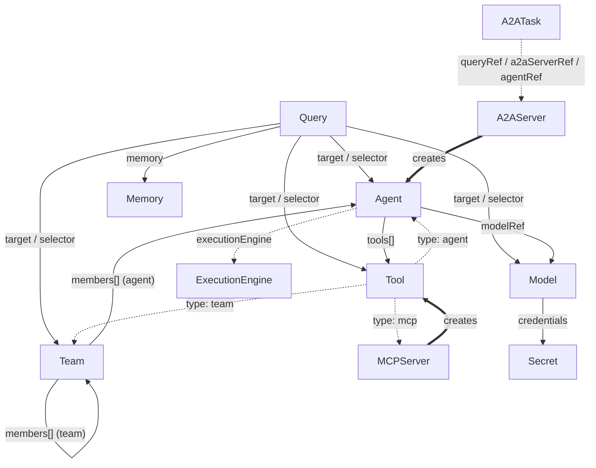

# Resource Relationships

Ark resources are Kubernetes objects that reference each other by name. The controller resolves those references during reconciliation and rejects invalid ones through admission webhooks. This page maps the references between resource types, the resources Ark creates for you, and the namespace and validation limits that constrain them.

For how a request actually runs, see [Query Execution Flow](/reference/query-execution). For each resource's fields, see [Resources](/reference/resources).

## Dependency map



Solid arrows are references you author; `==>` marks resources the controller **creates automatically**; dotted arrows are optional or conditional references.

## References by resource

| Resource | References | Referenced by |
| --- | --- | --- |
| **Query** | `target` or `selector` → Agent / Team / Model / Tool; `memory` → Memory | — (created by users, the API, or the dashboard) |
| **Agent** | `modelRef` → Model; `tools[]` → Tool; `executionEngine` → ExecutionEngine | Query (`target`), Team (`members`), Tool (`type: agent`) |
| **Team** | `members[]` → Agent or Team; `selector.agent` → Agent | Query (`target`), Team (nested `members`), Tool (`type: team`) |
| **Model** | credentials via Secret / ConfigMap (`valueFrom`) | Agent (`modelRef`), Query (`target`) |
| **Tool** | `mcp` → MCPServer; `agent` → Agent; `team` → Team (per `type`) | Agent (`tools[]`), Query (`target`) |
| **MCPServer** | address + credentials via Secret / ConfigMap | Tool (`type: mcp`) — created for each discovered tool |
| **Memory** | address (the backing store, e.g. the broker) | Query (`memory`) |
| **A2AServer** | address of a remote A2A server | A2ATask (`a2aServerRef`) |
| **A2ATask** | `queryRef` → Query; `a2aServerRef` → A2AServer; `agentRef` → Agent | — (created by the controller) |
| **ExecutionEngine** | address of the engine (A2A) | Agent (`executionEngine`) |

Note that an **Agent does not reference Memory** — conversation history is attached to the **Query** (`spec.memory`) and resolved by the execution engine at run time.

## Resources Ark creates for you

Two controllers create resources from a discovered upstream, and own them so they are garbage-collected when the parent is deleted:

- **MCPServer → Tools.** When an `MCPServer` becomes reachable, its controller discovers the server's tools and creates a `Tool` (`type: mcp`) for each, labelled with the server name and owned by the `MCPServer`. Delete the server and its tools go with it.
- **A2AServer → Agents.** When an `A2AServer` is reachable, its controller discovers the remote agents it advertises and creates a local `Agent` for each, with `executionEngine.name: a2a` so queries dispatch to the remote server. The agents are owned by the `A2AServer`.
- **Query → A2ATask.** When a query runs against an A2A-backed agent, an `A2ATask` tracks the asynchronous task — it references the originating `Query`, the `A2AServer` to poll, and the `Agent`. See [A2ATask](/reference/resources/a2atask).

## Namespace scope

References resolve within a single namespace unless the reference type carries its own `namespace` field:

| Reference | Cross-namespace? |
| --- | --- |
| `Agent.spec.modelRef` | Yes — honours `modelRef.namespace` (defaults to the agent's namespace). |
| `Agent.spec.executionEngine` | Yes — honours `executionEngine.namespace` (except the built-in `a2a` engine, which needs no resource). |
| `Query.spec.memory` | Yes — honours `memory.namespace` (resolved by the execution engine). |
| `Query.spec.target` / `spec.selector` | **No** — resolved in the query's namespace. There is no namespace field on a target. |
| `Team.spec.members[]` | **No** — members must live in the team's namespace. |

Because every resource is namespaced, a namespace acts as a tenant boundary. See [Tenant and Namespace Management](/operations-guide/tenant-namespace-management).

## Limitations and constraints

The admission webhooks reject relationships that can't work, so most problems surface at `kubectl apply` time rather than at run time:

- **Query targets exactly one thing.** Set either `spec.target` or `spec.selector`, not both and not neither. A `selector` resolves to the **first** matching resource (checked Agent → Team → Model → Tool) — it is not a fan-out across matches.
- **Query targets are same-namespace.** The named target (or selector match) must exist in the query's namespace.
- **Teams can't mix execution engines.** All agent members must be either internal (no `executionEngine`, or the built-in `a2a` engine) or external (a named engine) — a team can't contain both.
- **Teams can't reference themselves.** A member can't share the team's own name; nested teams (`members[].type: team`) are allowed otherwise.
- **Deprecated team strategies are migrated.** `round-robin` and standalone `graph` are accepted but rewritten by the mutating webhook (`round-robin` → `sequential` with loops; `graph` → `sequential`, with the graph edges discarded). Author new teams with `sequential` or `selector`. See [Teams](/reference/resources/team).
- **Missing dependencies block readiness.** If a referenced Model, Tool, or engine doesn't exist, the dependent resource's `Available` condition stays `False` with a reason such as `ModelNotFound`, and flips to `True` automatically once the dependency appears.

```yaml
status:
  conditions:
    - type: Available
      status: "False"
      reason: ModelNotFound
      message: "Model 'gpt-4o' is not available"
```

## Creating and deleting related resources

You don't have to create resources in a strict order — a dependent resource simply stays `Available: False` until its dependencies exist, then reconciles automatically. A natural order that avoids transient warnings:

1. **Secrets** — API keys and credentials.
2. **Models** — reference their secrets.
3. **Memory**, **Tools**, **MCPServers**, **ExecutionEngines** — supporting resources.
4. **Agents** — reference models, tools, and engines.
5. **Teams** — reference agents (and nested teams).
6. **A2AServers** — discovered agents appear as new `Agent` resources.

For deletion, controller-created resources (Tools from an MCPServer, Agents from an A2AServer) are removed automatically with their parent via owner references. Deleting a `Query` triggers a finalizer that also removes the messages it wrote to its `Memory` backend — see [Query → Deletion and cleanup](/reference/resources/query#deletion-and-cleanup).

```bash
kubectl describe agent weather-agent   # spec, status conditions, and events
kubectl get models                     # AVAILABLE column reflects health probes
ark teams                              # list teams via the CLI
```

## Related

- [Query Execution Flow](/reference/query-execution) — how a query runs end to end.
- [Resources](/reference/resources) — every CRD, field by field.
- [Core Architecture](/reference/core-architecture) — the services behind these resources.
